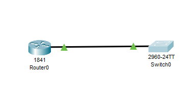
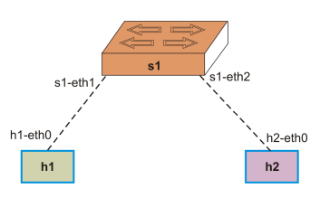
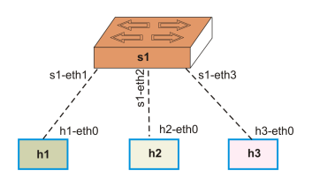
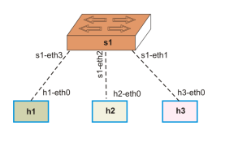
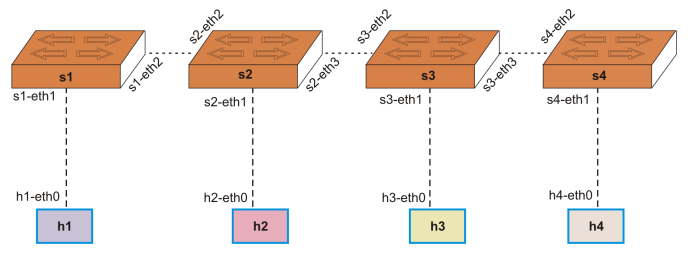
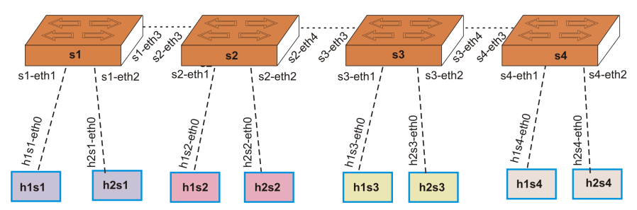
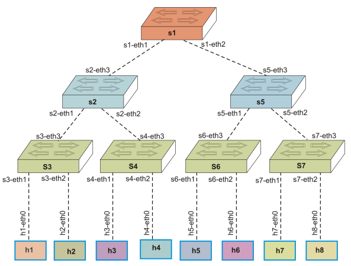
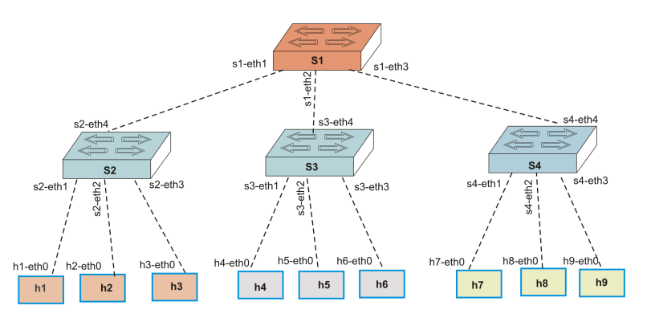

# infra-sdn

Neste repositorio iremos trabalhar em projetos de redes usando conceitos e ferramentas como SDN, OpenFlow, Mininet, POX Controller, criação de aplicações SDN, ovs-ofctl, topologias customizadas e Wireshark.


Redes Definidas por Software (SDN) representam uma arquitetura inovadora que separa o plano de controle do plano de dados, permitindo um gerenciamento centralizado e programável da rede. O protocolo OpenFlow é fundamental para essa arquitetura, possibilitando que o controlador SDN gerencie diretamente os dispositivos de rede. Ferramentas como Mininet facilitam a criação de redes virtuais para testes e desenvolvimento, enquanto o controlador POX oferece uma plataforma acessível para a criação de aplicações SDN em Python. O utilitário ovs-ofctl permite a manipulação das tabelas de fluxo do Open vSwitch, essencial para depuração e configuração. A capacidade de criar topologias customizadas no Mininet permite simular cenários de rede específicos, e o Wireshark é uma ferramenta valiosa para analisar o tráfego de rede e garantir o correto funcionamento das aplicações SDN.

## Redes SDN vs Tradicioanis

Redes tradicionais envolvem dispositivos de rede que interconectam computadores, servidores e outros dispositivos, garantindo fluxo de dados, segurança e gerenciamento eficiente. Esses dispositivos geralmente desempenham funções específicas na infraestrutura de rede.

### Dispositivos de Rede

**1. Hub:**
- Dispositivo simples que retransmite sinais de entrada para todas as portas, sem gerenciamento inteligente.
- Funciona na camada física do modelo OSI.
- Não distingue between destinos, o que pode levar a colisões e baixa eficiência.

**2. Switch:**
- Atua na camada de enlace de dados (Camada 2).
- Aprende endereços MAC e envia os dados somente para o dispositivo destino específico.
- Pode ser comutado (switching) ou gerenciado (com suporte a configuração avançada).

**3. Router:**
- Opera na camada de rede (Camada 3).
- Encaminha pacotes entre redes diferentes usando endereços IP.
- Realiza funções de roteamento, NAT, DHCP, entre outros.

**4. Firewall:**
- Dispositivo ou software que controla o tráfico de rede com base em regras definidas.
- Pode trabalhar na Camada 4 (transporte) ou mais alto, dependendo da tecnologia.
- Protege a rede de acessos não autorizados e ataques.

**5. IDS (Intrusion Detection System):**
- Detecta tentativas de intrusão ou atividades suspeitas na rede.
- Monitora o tráfego e sinaliza possíveis ameaças, mas geralmente não bloqueia automaticamente.

**6. IPS (Intrusion Prevention System):**
- Similar ao IDS, mas com capacidade de bloquear ou bloquear automaticamente atividades maliciosas detectadas.

**7. Load Balancer (Balanceador de Carga):**
- Distribui o tráfego de entrada entre múltiplos servidores ou recursos.
- Melhora desempenho, alta disponibilidade e escalabilidade.

### Control Plane e Data Plane

Muitos dispositivos modernos têm uma arquitetura que separa suas funções em *Control Plane* e *Data Plane*:

- **Control Plane:** Responsável pelo gerenciamento, controle, configuração e decisão do roteamento ou encaminhamento. Em dispositivos como switches e firewalls, o control plane determina as regras, políticas e tabelas de roteamento.

- **Data Plane:** Responsável pelo encaminhamento real do tráfego de dados de acordo com as decisões do control plane. Manipula pacotes de acordo com as regras estabelecidas (por exemplo, encaminhar, bloquear, modificar).

#### Desenho de rede simples no Packet Tracer:

**Router 1841** conectado a um **Switch 2690**.

- O roteador se conecta à porta Ethernet do switch via uma interface FastEthernet (por exemplo, FastEthernet0/0).

O esquema seria assim:



1. Configurações básicas no Router (CLI):

Ao acessar a CLI do roteador, você executa esses comandos:

```bash
enable            # Para entrar no modo privilegiado
conf t            # Acesso ao modo de configuração global
hostname R1     # Define o nome do roteador como R1
interface FastEthernet0/0  # Entrada na interface
ip address 192.168.1.1 255.255.255.0  # Configura o endereço IP na interface
no shutdown      # Ativa a interface
exit
```

3. Comando no switch:

No switch, você pode usar:

```bash
show mac-address-table
```

Para visualizar a tabela MAC, que mostra quais endereços MAC estão associados às portas.

Vamos por partes para esclarecer cada tópico:

### Problemas das redes tradicionais

1. **Gerenciamento centralizado difícil:** Cada dispositivo (switch, roteador) é configurado individualmente, o que aumenta a complexidade e a possibilidade de erros.
2. **Baixa flexibilidade e agilidade:** Alterações na rede, como rotas ou políticas, muitas vezes requerem intervenção manual em vários dispositivos.
3. **Escalabilidade limitada:** Redes grandes se tornam complexas de gerenciar, dificultando a implementação de mudanças rápidas.
4. **Dificuldade na implementação de políticas de segurança e QoS:** Configurar regras de segurança ou qualidade de serviço (QoS) de forma uniforme é trabalhoso.
5. **Propagação de falhas:** Problemas podem se espalhar facilmente, pois os dispositivos operam de forma independente.

### Separação do Control Plane e Data Plane nas redes SDN

Nas redes **SDN (Software Defined Networking)**:

- **Control Plane:**  
  - Centralizado em um **Controlador SDN** (software), que é um cérebro que gerencia toda a rede.  
  - Define políticas, rotas, regras de segurança e configura os dispositivos da rede.
- **Data Plane:**  
  - Nos dispositivos (switches, roteadores), que atuam como **forwarders** (encarregados de encaminhar pacotes).  
  - Executam as decisões do controlador, encaminhando o tráfego de acordo com as regras recebidas.

**Vantagem:**  
Uniformidade, facilidade de gerenciamento, rápida implementação de mudanças, maior flexibilidade e automação.

## Comparativo de APIs e Interfaces

| Aspecto | Redes Tradicionais | Redes SDN |
|---|---|---|
| **Controle** | Distribuído, embutido nos dispositivos | Centralizado, no controlador SDN |
| **Configuração** | Manual em cada dispositivo ou via protocolos específicos (SNMP, CLI, etc.) | Programática via APIs centralizadas |
| **Regras de fluxo** | Configuradas localmente em cada dispositivo | Definidas pelo controller, enviadas via APIs ao forwarder |
| **API principal** | SNMP, CLI, NetConf, RESTCONF (DDL global, não uniformes) | APIs abertas como **OpenFlow**, **REST API** (por exemplo, RESTful), que permite programação e automação |
| **Flexibilidade** | Limitada a configurações locais, difícil de alterar globalmente | Alta, alterações centralizadas e automáticas através de APIs |

### Resumo
- **Rede tradicional:** controle distribuído, configuração manual, difícil de escalar ou mudar rapidamente.
- **SDN:** controle centralizado via controladores, regras enviadas por APIs padronizadas (ex: OpenFlow, REST API), software-first, maior flexibilidade e facilidade de automação.

## O que são e como atuam os **SDN Network Apps** (Aplicações de Rede SDN)

**SDN Apps** são aplicativos de rede implementados na camada superior do controlador SDN, responsáveis por funções específicas como:

- **Switching ( encaminhamento de pacotes )**  
  - Aplicações que gerenciam o fluxo de dados, decidindo como encaminhar tráfego de forma inteligente.  
- **Routing (roteamento)**  
  - Desenvolvem políticas de roteamento flexíveis e dinâmicas, muitas vezes além das rotas tradicionais.  
- **Load Balancing (balanceamento de carga)**  
  - Distribuem o tráfego entre servidores ou recursos, otimizando desempenho e disponibilidade.  
- **Firewall**  
  - Implemetam políticas de segurança, controlando o acesso e protegendo a rede contra ameaças.

### Como atuam:
- Essas aplicações rodam no **SDN Controller**, acessando e manipulando a tabela de fluxo dos switches via APIs (como OpenFlow).  
- Elas definem as regras de fluxo, políticas de segurança, vias de encaminhamento, etc., e enviam essas regras aos dispositivos da rede para execução eficiente e centralizada.

### O papel do **SDN Controller**

- É o cérebro da rede SDN.  
- Gerencia toda a infraestrutura, define políticas, rotas, segurança, QoS, etc.  
- Comunica-se com os dispositivos (switches, roteadores) usando protocolos padronizados como **OpenFlow**.  
- Hospeda as **SDN Apps** que implementam funcionalidades específicas.

### Como funciona o **OpenFlow**

- **Protocolo padrão** que conecta o Controller aos switches (forwarders).  
- Permite que o Controller envie **regras de fluxo** aos switches.  
- Os switches, ao receberem pacotes, consultam sua **flow table** para decidir como encaminhar cada pacote.  
  - Se uma regra existir, seguem-na;  
  - Caso contrário, encaminham o pacote para o Controller para decisão.  
- Assim, toda a lógica de encaminhamento é centralizada e flexível.


| Componente | Descrição | Como funciona |
|---|---|---|
| **OpenFlow** | Protocolo de comunicação entre Controller e switches | Define o padrão de troca de regras de fluxo e ações nos dispositivos SDN |
| **Open vSwitch (OvS)** | Switch virtual de código aberto compatível com OpenFlow | Funciona como o forwarder, executando as regras recebidas do controlador |
| **SDN Controller** | Núcleo central de gerenciamento da rede (ex: ONOS, OpenDaylight, Ryu) | Controla dispositivos, armazena políticas, distribui regras de fluxo via OpenFlow |
| **SDN Apps** | Aplicações específicas no controlador (ex: firewall, LB, roteamento, switching) | Implementam funcionalidades de rede, requestam/influenciam regras no forwarder via API |

Ou seja, as **SDN Apps** abstraem funcionalidades específicas (roteamento, segurança, balanceamento) que se comunicam com o **Controller**. O **Controller** coordena tudo, enviando regras aos **switches** através do **OpenFlow**. **Open vSwitch** é um **switch virtual** que executa as regras de fluxo recebidas, realizando o encaminhamento do tráfego.


### Exemplos de Controllers, suas linguagens, pontos fortes e fracos

| **Controller** | **Linguagem** | **Pontos Fortes** | **Pontos Fracos** |
|----------------|--------------|------------------|------------------|
| **OpenDaylight** | Java | Muito popular, suporta vários protocolos, possui uma grande comunidade | Pode ser pesado e complexo para pequenas redes |
| **Ryu** | Python | Simples, fácil de aprender, rápido para prototipagem | Menor escala, menos otimizações para grandes redes |
| **ONOS** | Java | Alta escalabilidade, focado em grandes redes/carrier-grade | Mais complexo de configurar e administrar |
| **Floodlight** | Java | Open-source, fácil de usar, bom para testes | Menor suporte a protocolos e recursos avançados |
| **NOX** | C++ / Python | Bom desempenho, antigo, confiável | Menos ativo, substituído por projetos mais modernos |


### O que é a **Flow Table**?

A **Flow Table** (tabela de fluxo) é a estrutura de dados mantida por cada **switch** ou **forwarder** em uma rede SDN. Ela armazena as regras de encaminhamento de pacotes. Quando um pacote chega ao switch, ele consulta a flow table. Se encontrar uma regra que combina com o pacote (com base em atributos como IP, MAC, porta, etc.), executa a ação definida (reencaminhar, descartar, modificar). Se não, envia o pacote ao controlador para receber uma resposta/regra nova.

## Componentes de uma **Flow Table** e suas funções:

| Componente | Função |
|--------------|---------|
| **Match Fields** | Critérios usados para identificar o pacote (por exemplo, entrada de porta, endereço MAC/IP, TCP/UDP, VLAN, etc.) |
| **Priority** | Define a prioridade da regra (quando há múltiplas regras, a de maior prioridade é aplicada) |
| **Counters (Contadores)** | Mantém estatísticas: número de pacotes, bytes, tempo desde a última ação, etc., útil para monitoramento e tomada de decisão |
| **Timeouts** | Tempo de validade da regra (flow timeout e hard timeout) para remover ou atualizar regras automaticamente |
| **Actions (Ações)** | O que fazer com os pacotes que combinam com a regra (reencaminhar para uma porta, modificar cabeçalhos, descartar, enviar ao controlador) |

## Como criar exemplos no Mininet

**Mininet** é uma ferramenta que permite simular uma rede SDN, incluindo hosts, switches e controladores, tudo em um ambiente virtual.

### Exemplo básico de criação de uma rede simples com Mininet:

```bash
# Inicie o Mininet com uma topologia simples
sudo mn --controller=remote --topo=single,3

# Explicação:
# --controller=remote  -> conecta ao controlador SDN rodando em outro lugar (ou localhost)
# --topo=single,3     -> cria uma topologia com 1 switch e 3 hosts
```

Como adicionar um flow manualmente usando comandos do OpenFlow, no prompt do mininet:


```bash
# Acessando o switch
h1 ip route add default via 10.0.0.2
# Enviar uma mensagem de fluxo ao switch via ovs-ofctl:
sudo ovs-ofctl add-flow s1 "priority=10,ip,nw_dst=10.0.0.3,actions=output:2"
```

Este comando define um fluxo para encaminhar IP destino 10.0.0.3 ao porta 2.

### O que é um **Flow Port**?

Flow port é um **port number** (número de porta) do switch, ativo na camada física ou lógica.

### Tipos:

- **Porta física:**  
  - Uma porta física real do switch (exemplo: Ethernet 1/0/1).  
  - É uma porta de conexão física, conectada a um host ou outro switch.

- **Porta lógica:**  
  - Uma porta lógica para conectar VLANs, tunneling, ou interfaces virtuais.  
  - Usada em ambientes virtuais ou de redes overlay.

- **Portas reservadas:**  
  - Algumas portas são reservadas para funções especiais, como a conexão com o controlador (exemplo: port 65534 ou 6633).

### O que são **OpenFlow Messages**? Exemplos de fluxo

**OpenFlow Messages** são comandos trocados entre o controlador e os switches para manipular a tabela de fluxo e controlar o encaminhamento.

### Tipos principais de mensagens:

- **OFPT Flow Mod:**  
  Para adicionar, modificar ou excluir regras (flows) na tabela de fluxo.
  
- **OFPT Packet In:**  
  O switch envia um pacote ao controlador (quando não há regra correspondente).
  
- **OFPT Packet Out:**  
  O controlador envia o pacote de volta ao switch com instruções de encaminhamento.

- **Flow Stats Request/Reply:**  
  Para consultar estatísticas da tabela de fluxo.

Exemplo de uma mensagem de fluxo (Flow Mod), o qual, um comando do controlador para criar uma regra que encaminha todo IP destinado a 10.0.0.3 ao porta 2:

```plaintext
FlowMod message:
- Match: ip, nw_dst=10.0.0.3
- Priority: 10
- Action: output to port 2
- Command: add (para criar uma nova regra)
```

## Projecto exemplo com mininet

1. Execute o script chamado "install_vb_vagrant.sh" presente na pasta vagrant deste projeto para instalar o Virtual box 7 + vagrant em sua maquina ubuntu ou debian. Para executar use os comando abaixo:

```bash
chmod +x install_vagrant.sh
./install_vagrant.sh

```

Apos instalação, acesse a pasta vagrant e execute o comando ``vagrant up``, o qual ira subir uma VM conforme descrito no arquivo vagrantfile da pasta corrente. Para acessar a maquina criada utilize o ``vagrant ssh``, para desligar ``vagrant halt`` e para remover ``vagrant destroy``.


2. Realize o downloa da VM do mininet em https://github.com/mininet/mininet/releases e importe a mesma para o virtual box (File -> Import appliance).
Ao excuat a VMutilize os login: mininet e senha mininet:

sudo -s

mn --test pingpair

mn 
pingall

verifique as pastas ls- l e acesse a pasta do controlador  pox

Confirme que o controlador esta funcionanado
./pox.py pox.forwarding.hub

Criando diferentes topologias utilizando o mininet

### Minimal



### Single



### Reversed



### Linear





### Tree





## Referencias
- [Comandos mininet](https://mininet.org/walkthrough/)

## Criando aplicações SDN sem utilizar Controlers